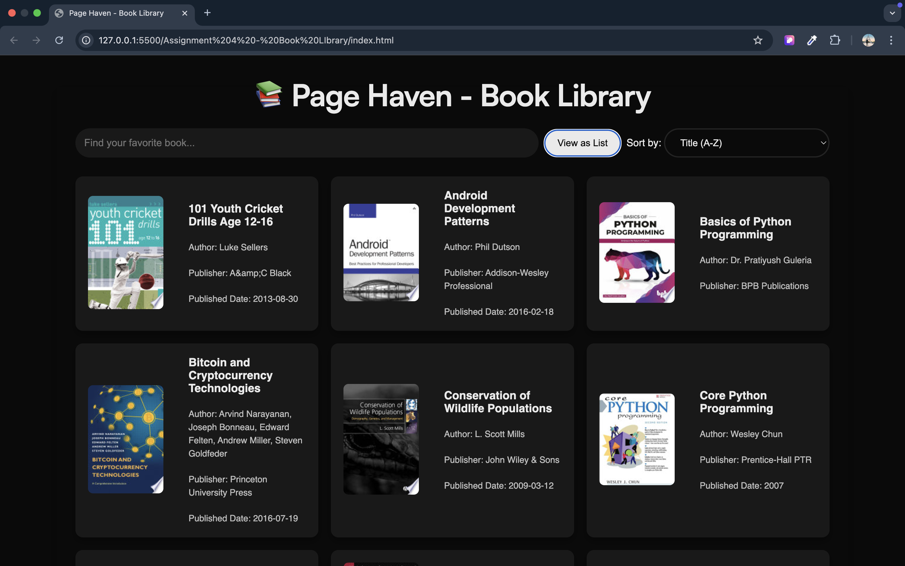
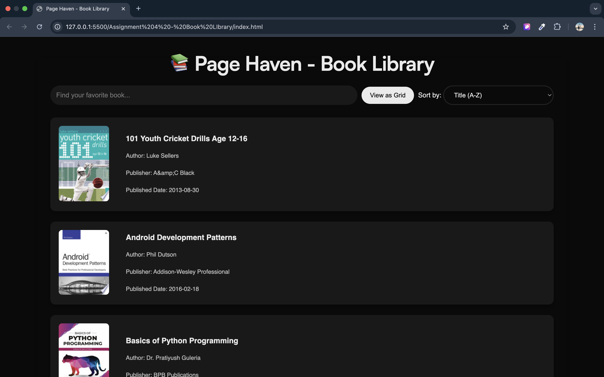

# 📚 Page Haven - Book Library

A **modern, minimalistic** book library web app with **pagination, filtering, sorting, GSAP animations, and smooth scrolling using Locomotive Scroll**.

 <!-- Replace with actual image link -->

---

## 🚀 Features
✅ **Smooth Pagination** – Easily navigate through pages without skipping.  
✅ **Search & Filter** – Find books by **title** or **author**.  
✅ **Sorting Options** – Sort books **A-Z, Z-A, Oldest to Newest, Newest to Oldest**.  
✅ **Grid/List View Toggle** – Switch between **grid and list views** dynamically.  
✅ **GSAP Animations** – Smooth fade-in effects for elements.
✅ **API Integration** – Fetches real book data from [Free API](https://freeapi.app/).  

---

## 🛠️ Technologies Used
- **HTML5** – Structuring the web page  
- **CSS3** – Styling and animations  
- **JavaScript (ES6)** – Functionality and interactivity  
- **GSAP (GreenSock Animation Platform)** – Animations  
- **Free API** – Fetching book data  

---

## 🏗️ Project Setup & Installation
### **1️⃣ Clone the Repository**
```sh
git clone https://github.com/Ansh0330/book-library
cd book-library
```

### **2️⃣ Open `index.html` in Your Browser**
Simply open the `index.html` file in any modern browser.  

### **3️⃣ Or Use Live Server (Recommended)**
If you have VS Code installed, open the folder and run:
```sh
npx live-server
```
This will start a local development server.

---

## 🎮 How to Use
1️⃣ **View Books** – Books are displayed on page load.  
2️⃣ **Use Pagination** – Click **Next / Previous** to navigate pages.  
3️⃣ **Search Books** – Use the search bar to find books by title or author.  
4️⃣ **Sort Books** – Select a sorting option (**A-Z, Z-A, Date Ascending, Date Descending**).  
5️⃣ **Toggle Grid/List View** – Click the "View as Grid" button to change the layout.  

---

## 🖼️ Screenshots
| 📖 List View  | 🔳 Grid View |
|--------------|-------------|
|  |  |

---

## 🛠️ Project Structure
```
📂 book-library
 ┣ 📜 index.html       # Main HTML file
 ┣ 📜 style.css        # Styles and animations
 ┣ 📜 script.js        # JavaScript functionality
 ┣ 📜 README.md        # Project documentation
```

---

## 🔥 Future Enhancements
🔹 **Dark Mode Toggle** – Add a switch for light/dark mode.  
🔹 **Bookmark Feature** – Allow users to save favorite books.  
🔹 **Lazy Loading** – Improve performance by loading images progressively.  

---

## 💙 Credits
API used: **[Free API](https://freeapi.app/)**  
Made with ❤️ by **[Ansh](https://github.com/Ansh0330)**  

---

## 📜 License
This project is licensed under the **MIT License** – Feel free to modify and use it!  

---

🚀 **Happy Coding & Enjoy Your Book Library!** 🎉

